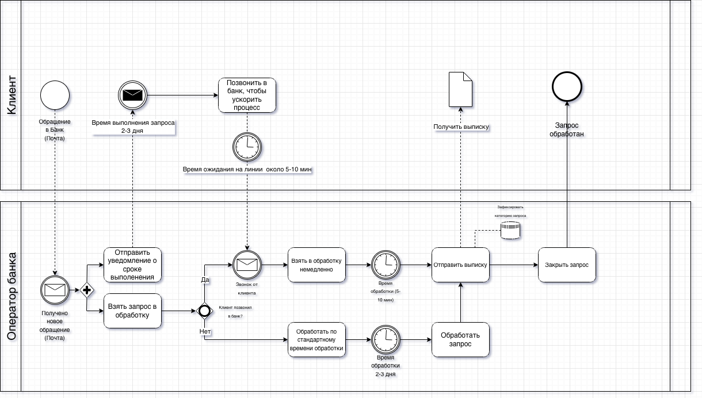

# Customer Support Process Optimization for Bank "Sberegai"

## Project Overview

This project focuses on analyzing and optimizing the customer support process of a regional bank.

The bank conducted a customer satisfaction survey which revealed that the average satisfaction score with the support service was **6.3 out of 10**.  
The business goal was to increase this показатель to **8 out of 10** by improving the customer support process and introducing automated feedback collection.

The project includes analysis of the current process, identification of bottlenecks, and design of an improved support workflow.

---

# Business Problem

Customer interviews and internal analysis revealed several issues:

- 80% of support requests come via phone calls
- customers often prefer written communication but are forced to call
- average email response time reaches **2 days**
- support operators spend **80% of their time answering calls**
- **60% of requests are repetitive**
- no automated **feedback collection** after support interaction

These problems lead to:

- operator overload
- slow response times
- reduced customer satisfaction

---

# Solution

The proposed solution introduces a **chat-based support system inside the mobile banking application**.

Key elements of the solution:

• Chat support inside the mobile application  
• Chatbot for handling common requests  
• Escalation to a support operator when necessary  
• Automated customer feedback collection after request resolution

This approach reduces operator workload and improves response speed.

---

# My Role as Business Analyst

During this project I performed the following tasks:

- analyzed stakeholder interviews
- identified key pain points in the support process
- modeled the **AS-IS business process**
- designed the **TO-BE optimized process**
- created a **User Story Map**
- developed **Lo-Fi prototypes** of the proposed solution

---

# Business Process Modeling

## AS-IS Process

The AS-IS BPMN model reflects the current process of handling customer requests through:

- phone support
- email communication

The diagram highlights the main inefficiencies of the existing workflow.

## TO-BE Process

The TO-BE model introduces:

- chat support
- chatbot automation
- feedback collection
- faster request resolution

---

# User Story Map

User Story Mapping was used to define:

- the main user journey
- key system capabilities
- functional requirements for the new solution

Core user actions include:

- contacting support via chat
- receiving automated responses
- escalating to an operator
- leaving feedback after request resolution

---

# Lo-Fi Prototype

A low-fidelity prototype was designed to demonstrate the future interface of the support system.

### Main screens

**Authorization screen**

- bank logo
- login and password fields
- login button
- quick access to support

**Contact options screen**

Users can choose their preferred communication channel:

- chatbot
- phone call
- email

**Chatbot interface**

Users can quickly select common requests:

- account statement
- branch information
- password recovery
- subscription cancellation
- promotions
- other question
- contact operator

**Operator communication**

If the chatbot cannot resolve the request, the user can contact a support operator.

**Feedback collection**

After the issue is resolved, the user can rate the support experience.

---

# Project Artifacts

This repository includes the following artifacts:

- AS-IS BPMN model
- TO-BE BPMN model
- User Story Map
- Lo-Fi prototype
- project presentation

---

# Tools Used

- BPMN
- Miro
- Draw.io
- User Story Mapping
- Lo-Fi Prototyping

---

# Expected Business Impact

The proposed solution allows the bank to:

- reduce operator workload
- automate common requests
- reduce response time
- implement systematic feedback collection
- increase customer satisfaction

---

## AS-IS BPMN Process

---

# Author

Business Analyst Portfolio Project  
Author: Zargam Guliyev
