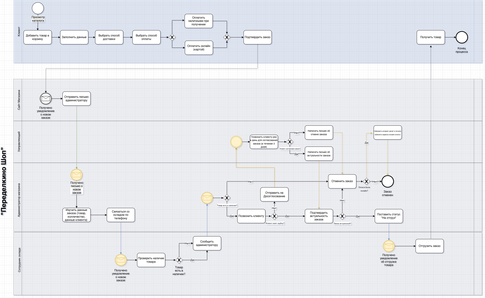
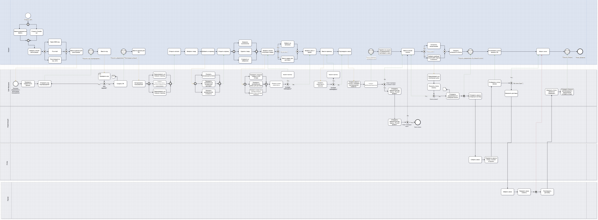

# E-commerce Checkout Optimization

## Project Overview

This project focuses on analyzing and improving the checkout process of an e-commerce platform.

The goal of the project was to identify bottlenecks in the checkout flow and design a more efficient user journey that reduces cart abandonment and improves the overall purchase experience.

The project includes analysis of the current checkout process, identification of key usability issues, and design of an optimized checkout workflow.

---

# Business Problem

Analysis of the current checkout process revealed several issues that negatively impact the conversion rate.

Key problems include:

- long and complex checkout flow
- unnecessary form fields
- duplicate information input
- unclear validation and error messages

These problems lead to:

- high cart abandonment rate
- longer checkout time
- poor user experience during purchase

---

# Solution

The proposed solution introduces an optimized checkout process focused on simplifying the purchase flow.

Key elements of the solution:

• reduction of checkout steps  
• grouping of related input fields  
• introduction of autofill for customer data  
• improved validation and error messaging  

These improvements aim to make the checkout process faster and more user-friendly.

---

# My Role as Business Analyst

During this project I performed the following tasks:

- analyzed the current checkout workflow
- identified usability issues in the purchase process
- modeled the **AS-IS business process**
- designed the **TO-BE optimized process**
- created **Customer Journey Map**
- developed **Lo-Fi interface prototypes**

---

# Business Process Modeling

## AS-IS Process

The AS-IS BPMN model reflects the current checkout process.

Current checkout flow:

1. User adds products to cart  
2. Opens checkout page  
3. Fills personal information  
4. Selects delivery method  
5. Selects payment method  
6. Confirms order  

The analysis revealed several inefficiencies in the process.

---

## TO-BE Process

The TO-BE model introduces a simplified checkout flow with fewer steps and improved user interaction.

Main improvements:

- simplified data input
- fewer steps in checkout
- improved validation logic
- better order confirmation process

---

# User Experience Analysis

Customer Journey Mapping was used to analyze the customer experience during the checkout process.

This helped identify pain points in the user journey and define opportunities for improving the purchasing flow.

---

# Lo-Fi Prototype

A low-fidelity prototype was created to demonstrate the improved checkout interface.

The prototype includes redesigned checkout screens with simplified input forms and clearer user interaction.

---

# Project Artifacts

This repository includes the following artifacts:

- BPMN AS-IS process model
- BPMN TO-BE process model
- Customer Journey Map
- UML Class Diagram
- UML Object Diagram
- Lo-Fi interface prototype
- project presentation

---

# Tools Used

- BPMN
- Miro
- Draw.io
- Figma
- Customer Journey Mapping

---

# Expected Business Impact

The proposed solution allows the company to:

- reduce cart abandonment rate
- simplify the checkout process
- improve user experience during purchase
- increase checkout conversion rate

---

## AS-IS BPMN Process

---

## TO-BE BPMN Process

---

## Class Diagram

---

## Object Diagram

---

## Prototype

Figma prototype:  
https://www.figma.com/design/mEttQqVuK5qSnQFZGPJRV9/Ruslan-Kuliyevvv-s-team-library?node-id=0-1&t=lWTXDN3gUAVZVGN3-1

---

## Customer Journey Map

https://miro.com/app/board/uXjVJnl-Cqg=/?share_link_id=765060641053

---

## Presentation

https://docs.google.com/presentation/d/1z3UC3SuHwoZCUNpuFSfzhAa9LFClFuGbdtxGCF0tgDo/edit?usp=sharing

---

# Author

Business Analyst Portfolio Project  
Author: Zargam Guliyev
