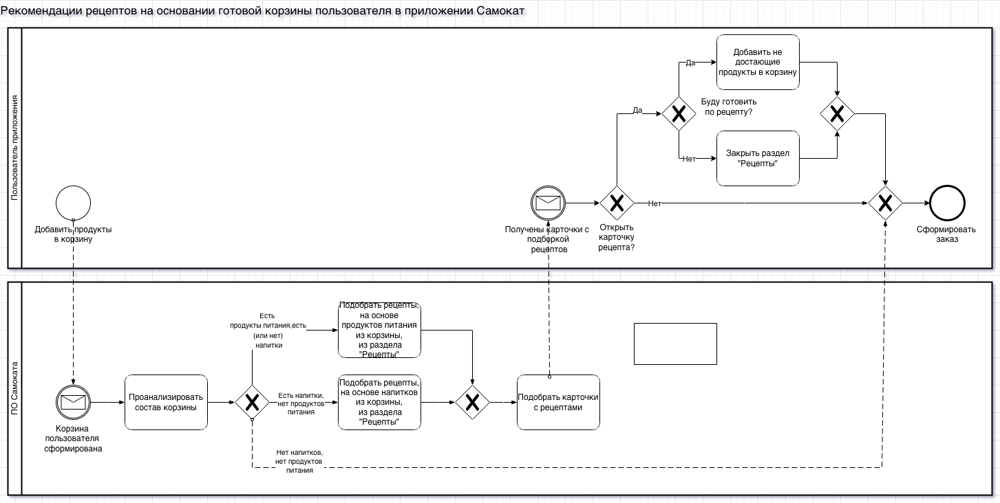

# SPA CRM / PMS System

## Project Overview

Business analysis project for designing CRM and PMS system improvements for a SPA hotel.

The goal was to improve client management, booking processes and internal operations.

---

## Problem

Existing systems do not fully support SPA-specific processes:

- client booking management
- service scheduling
- reporting for SPA services

This creates inefficiencies in daily operations.

---

## Business Goal

Improve service management and increase operational efficiency.

---

## AS-IS Process

Current workflow:

1. Client requests booking
2. Administrator checks availability
3. Booking recorded manually
4. Staff assigned to service
5. Service completed
6. Payment recorded

Problems identified:

- manual booking management
- lack of automated reporting
- limited visibility of resource availability

---

## TO-BE Solution

Improved CRM/PMS functionality:

- automated booking management
- centralized client database
- service scheduling system
- improved reporting

---

## Artifacts

- BPMN process diagrams
- Use Case scenarios
- Technical specification
- Lo-Fi prototype

---

## Tools

BPMN  
Use Case  
Draw.io  
Miro

---

## TO-BE BPMN Process

---

## Lo-Fi Prototype

Prototype: https://miro.com/app/board/uXjVGzNinE8=/?share_link_id=512379998099

---

# Author

Business Analyst Portfolio Project  
Author: Zargam Guliyev
